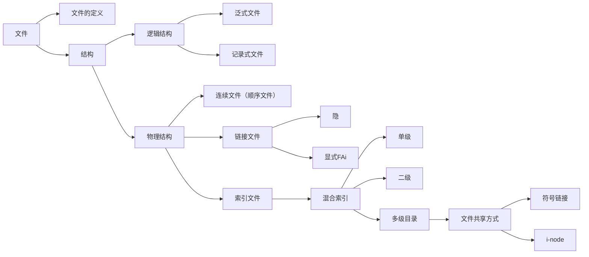

# 操作系统复习大纲

**考试题型：**

- 选择题：25×2 = 50分
- 填空题：5×2 = 10分
- 大题分：10×4 = 40分

### 四道大题分别是：

- 进程管理（进程同步）
- 死锁（银行家算法）
- 处理机调度（算周转时间、平均带权时间）
- 存储管理（离散多址的地址映射置换算法）

**考试范围：**

- 概念
- 进程管理（进程控制、进程同步）
- 死锁
- 处理机调度
- 存储管理（实存、虚存）
- 文件系统

---

## 一、绪论

### 考点内容
1. **基本概念**
   - 裸机
   - VM（虚拟机）
   - OS概念
   - OS特点（并发、共享（基本分类：批处理、分时、实时）、虚拟、异步）
2. 原理：多道程序技术

---

## 二、进程管理（并发管理）

### 1. 进程：定义、特点、结构（程序和数据、PCB：内存、（前驱图、PC)）

### 2. 状态及变迁图

### 3. 原语、处理机状态

### 4. 进程的关系（互斥：CS,CR、同步：信号量）

### **处理机调度：**挑选+指派

三个层次：高级、低级、中级（执行频率、算法复杂度）

### **调度算法：**

1. **FCFS**（先来先服务）
2. **SJF (SPF)**（短作业优先）
3. **Round Robin**（时间片轮转）
4. **优先调度**（静态、动态）高响应比优先
5. **多级反馈队列轮转**

### 评价：

- 批处理
- 周转时间、带权周转
- 分时：响应时间
- 实时：截止时间

---

## 三、死锁

### 1. **死锁定义**、表现、危害、原因
### 2. 死锁的解决：

#### ①死锁预防法（破坏必要条件）

- 互斥
- 环路（有效申请）
- 保持并请求（静态分配）
- 不可剥夺

#### ②死锁避免法
- **安全状态，与死锁关系**
- **银行家算法**（重点）

#### ③死锁定理（鸵鸟算法）

### **评价：**

- 效果
- 代价
- R利用率

---

## 四、存储管理

### 1. 实存

#### 连续：

- 固定分配（内碎片）
- 可变分区（外碎片） 

4种制度：分配、回收、拼接

#### 离散：

- 分页
- 分段
- 段页式

### 2. 虚拟存储

#### 虚存策略
- 物理内存分配
- 置换
- 调入

#### 请求分页存储管理：

- 缺页中断处理机构
- 页表的扩充 2->6
- 置换算法（OPT、FIFO、LRU）

---

## 五、文件系统

### **辅存：**

- 空闲表
- 空闲链表（块、区（成组链接法））
- 位示图法

### **目录管理：**

- 目录项（i-node）
- FCB

