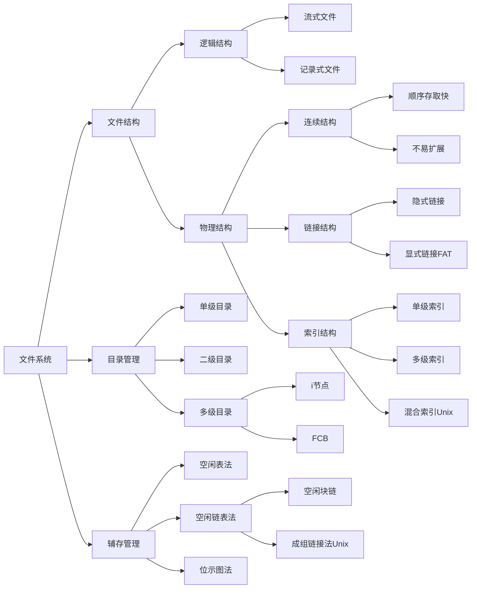

# 操作系统文件系统复习笔记

## 零、I/O系统与文件管理衔接（教材补充）

> 教材第7章先讲 I/O 系统，再深入文件/目录/辅存管理。以下提炼 I/O 相关考点，方便复习时“一份笔记覆盖整章”。

### 1. I/O 系统六大基本功能

1. **隐藏设备细节**：向上只暴露 `read/write/ioctl` 等抽象命令。
2. **保证设备无关性**：用户使用逻辑设备名（如 `/dev/printer`），驱动与具体硬件适配。
3. **提升 CPU/设备利用率**：快速响应 I/O 请求、减少 CPU 干预，使 CPU 与多设备并行。
4. **对设备实施控制**：通过设备驱动/控制器下发 PIO、DMA、Channel 等命令。
5. **确保共享正确性**：独占设备要互斥分配，共享设备要调度访问顺序。
6. **错误检测与恢复**：低层尽量自动重试、纠错，无法处理时再向上汇报。

### 2. I/O 层次结构与接口

```
用户层库函数 → 系统调用接口 → 与设备无关的 I/O 软件
             → 设备驱动程序 → 中断处理程序 / DMA / 通道 → 设备控制器/设备
```

- **用户层 I/O 库**：`fopen/fread/printf` 等，处理缓存/格式化。
- **系统调用层**：`read/write/ioctl`，提供受控能力。
- **与设备无关的 I/O**：设备命名、逻辑名到物理名映射、缓冲/缓存管理、设备分配/保护。
- **设备驱动程序**：把抽象命令翻译成控制器寄存器操作，处理设备相关差错。
- **中断处理程序**：响应设备完成/出错中断，唤醒等待进程。

### 3. 设备类型、控制器与控制方式

- **设备分类**：
  - 按使用特性：存储设备 vs I/O 设备（输入/输出/交互）。
  - 按传输速率：低速（键盘）、中速（打印机）、高速（磁盘/光盘）。
  - 按共享性：独占设备（打印机）、共享设备（磁盘）。
  - 按数据组织：块设备 vs 字符设备。
- **设备控制器职责**：命令译码、数据交换、状态报告、设备寻址、缓冲、差错控制。现代系统多采用**内存映像 I/O**（MMIO），老系统有独立 I/O 端口。
- **控制方式**（按 CPU 参与度）：
  1. **程序查询/轮询 PIO**：CPU 主动反复检测状态寄存器，适合极低速设备，利用率最低。
  2. **中断驱动 I/O**：设备就绪后发中断，CPU 只在必要时介入，是常见字符设备方案。
  3. **DMA（Direct Memory Access）**：控制器负责在内存与设备间搬移整块数据，CPU 仅在开始/结束介入，适合高速块设备。
  4. **I/O 通道/处理机**：在大型机中，专门的 I/O 处理器可并行执行多条 I/O 程序，进一步减轻主 CPU 负担。

### 4. 设备无关性与分配管理

- **逻辑设备表 (LUT)**：记录逻辑名→物理设备名/驱动入口→当前占用者，实现“按名访问设备”。
- **设备/控制器/通道表**：OS 维护三级表格，解决“通道带多个控制器、控制器连多个设备”的分配。
- **独占设备互斥**：`open` 时若设备忙则阻塞/排队；释放后唤醒下一进程，避免死锁需规定申请顺序。
- **共享设备调度**：块设备采用 **磁盘调度算法**，字符设备按 FIFO/优先级缓冲队列出入。
- **假脱机 (SPOOL)**：把独占设备虚拟成共享设备——用户写入磁盘输入/输出井，假脱机守护进程统一与真实硬件交互，实现逻辑共享。

### 5. 缓冲区管理与公式记忆

| 机制             | 解决的问题/教材要点                                                         |
| ---------------- | ---------------------------------------------------------------------------- |
| **单缓冲区**     | CPU 与设备交替使用同一缓冲；处理一块数据时间 = `max(C, T) + M`（教材公式）      |
| **双缓冲区**     | 两个缓冲交替，生产者/消费者基本并行；处理一块时间 ≈ `max(C, T)` + 传输/搬运开销  |
| **环形/多缓冲**   | 三指针 `Nexti/Nextg/Current` 管理多块内存，适合速度相差大的生产者-消费者模型     |
| **缓冲池**       | 公用空/输入/输出队列 + `Getbuf/Putbuf` + 互斥/资源信号量，提高缓冲利用率         |
| **磁盘高速缓存** | 设在内存中的盘块缓冲区，结合“提前读 + 延迟写”减少物理 I/O 次数                 |

**假脱机打印示例**（教材 7.6）  
磁盘缓冲区（输入/输出井）+ 内存打印缓冲 + 假脱机管理进程：  
1. 用户进程只需把数据写入输出井并登记请求表；  
2. 假脱机进程轮询请求表→把数据搬到内存缓冲→驱动打印机；  
3. 打印完毕后释放盘块并通知用户。  
→ 逻辑上“打印机可并行服务多个进程”，实则串行执行，常考“如何共享独占设备”。

### 6. 磁盘性能与调度（教材原题高频）

- **访问时间公式**：`T_total = T_seek + T_rot + T_transfer + T_controller`  
  - 平均旋转延迟 `T_rot = 0.5 * (60 / RPM)`；  
  - 传输时间 = `块大小 / 传输速率`。
- **调度算法速记**：

| 算法              | 规则/特点                                       | 优点                         | 缺点/风险                        |
| ----------------- | ----------------------------------------------- | ---------------------------- | -------------------------------- |
| **FCFS**          | 按到达顺序                                      | 公平、实现简单               | 平均寻道长，易受长请求拖累        |
| **SSTF**          | 选择距离当前磁头最近的请求                      | 平均寻道短                   | 可能饿死远端请求                  |
| **SCAN（电梯）**  | 磁头往一个方向服务到尽头再反向                  | 兼顾距离和公平               | 端点请求等待时间稍长              |
| **LOOK**          | 像 SCAN 但到最远请求处就折返                    | 减少无效移动                 | 仍可能偏向中部                    |
| **CSCAN**         | 单向扫描到末端后直接回到起点再扫描              | 响应时间更均匀               | 回程期间所有请求需等待            |
| **CLOOK**         | 只在请求范围内循环                              | 避免“空跑”                   | 仍可能饿死边缘请求                |
| **N-step SCAN**   | 把请求队列分成固定大小子序列，逐段按 SCAN 处理   | 缓解饥饿，适合大量请求       | 调度复杂度增大                    |
| **FSCAN**         | 使用两个队列：一个接收新请求，一个执行 SCAN      | 避免队列无限增长             | 平均响应时间依赖批次大小          |

- **考试套路**：给定初始磁道和请求序列，画出轨迹并算平均移动距离；或结合访问时间公式算总延迟。

---

## 一、文件系统概述

### 1. 基本概念

**① 文件 (File)**:

- **定义**: 具有标识符（文件名）的一组相关信息的集合
- **标识符**: 用于标识文件，不同系统规定不同
  - DOS/Windows: 8+3格式，后扩展为长文件名
  - Unix/Linux: 弱化文件扩展名

**② 文件系统 (File System)**:

- **定义**: 操作系统中负责存取和管理文件信息的机构
- **组成**:
  - 管理文件所需的数据结构（FCB、存储分配表等）
  - 相应的管理软件
  - 访问文件的一组操作

**③ 文件系统模型**:

```
文件系统 = {
    文件（存放在辅存）
    文件目录（组织文件）
    管理软件（操作文件）
}
```

### 2. 文件的分类

**① 按用途分类**:

- **系统文件**: 系统软件构成，用户只能调用
- **用户文件**: 用户保存的文件（源代码、目标程序等）
- **库文件**: 标准子程序和常用应用程序，只允许调用

**② 按数据形式分类**:

- **源文件**: ASCII码或汉字组成
- **目标文件**: 二进制码，扩展名.obj
- **可执行文件**: 扩展名.exe

**③ 按操作保护分类**:

- **只读文件**: 仅允许读
- **读写文件**: 允许读/写
- **执行文件**: 允许调用执行，不允许读写
- **完全保护文件**: 什么都不许做

**④ 按性质分类** (Unix):

- **普通文件**: 一般系统文件和用户文件
- **目录文件**: 由文件目录组成
- **特殊文件**: 将设备看作文件

**习题对应**: 习题13答案C (逻辑结构由用户确定)

### 3. 文件的属性

- 文件类型
- 文件长度
- 文件位置（物理地址）
- 读取控制（读、写、执行权限）
- 建立时间、最后修改时间

### 4. 文件系统的功能

1. 用户可执行创建、修改、删除、读写文件命令
2. 用户能以合适方式构造文件
3. 用户能在系统控制下共享文件
4. 允许用户用**文件名访问**文件（按名存取）- 习题11答案B
5. 提供转存和恢复文件能力
6. 提供保护和保密措施

------

## 二、文件的逻辑结构

### 1. 逻辑结构分类

**① 有结构文件（记录式文件）**:

- 由若干相关记录构成
- 记录可以等长或变长

**示例**:

```
090601010  罗小宁  女  1988年5月  江苏连云港
090601011  王朔    男  1989年8月  江苏南京
```

**② 无结构文件（流式文件）**:

- 基本单位: 字节或字
- 长度: 文件中所含字节数
- 如: 源程序、库函数

### 2. 存取方法

**① 顺序存取**:

- 严格按信息单位排列顺序依次存取
- 后一次存取在前一次基础上进行
- 不需给出具体存取位置

**② 随机存取（直接存取）**:

- 必须先确定存取的起始位置（记录号）
- 可直接访问任意记录

**存取方法与存储介质**:

- **磁带**: 只能顺序存取
- **磁盘/磁鼓**: 既可顺序，也可随机

------

## 三、文件的物理结构 ⭐⭐⭐

### 1. 存储设备特性

**① 磁带**:

- 典型的**顺序存取**设备
- 物理块间有**间隙**（启动/停止时间）
- 存取速度取决于: 信息密度、带速、块间间隙

**② 磁盘**:

- 典型的**直接存取**设备
- 组成: 若干磁盘片，高速旋转
- **磁道**: 同心圆
- **扇区**: 磁道划分的等大小区域
- **柱面**: 不同盘面相同位置的磁道集合

**磁盘访问时间** = 寻道时间 + 旋转延迟 + 传输时间

- **寻道时间**: 移动磁头到指定磁道（占比最大）
- **旋转延迟**: 扇区移到磁头下
- **传输时间**: 读/写数据

**典型值**: 0.01 ~ 0.1秒

### 2. 物理块

- 存储设备划分为**大小相等**的物理块
- 典型大小: 512B 或 1024B
- 文件信息也划分为等大小的**逻辑块**
- **块**是分配和传输信息的基本单位

### 3. 连续结构（顺序结构）⭐⭐⭐

#### 基本思想

**定义**: 逻辑文件一次存放在外存的**若干连续**物理块中

**特点**:

- 文件在磁盘上的存放顺序与逻辑记录一致
- 可顺序存取，也可随机存取

**存储介质影响**:

- 磁带 → 顺序存取
- 磁盘 → 顺序或随机存取

#### 数据结构

**目录项**:

| 文件名 | 起始块号 | 长度 |
| ------ | -------- | ---- |
| count  | 0        | 2    |
| tr     | 14       | 3    |
| mail   | 19       | 6    |
| list   | 28       | 4    |

**示意图**:

```
0  1  2  3  | count占用块0,1
4  5  6  7  |
...
14 15 16 17 | tr占用块14,15,16
...
19 20 ... 24| mail占用块19-24
```

#### 优缺点

**优点**:

- ✅ 知道起始地址和长度即可**快速存取**
- ✅ **顺序访问速度最快**
- ✅ 实现简单

**缺点**:

- ❌ **文件长度不易改变**，不利于扩充
- ❌ 会产生**外碎片**
- ❌ 不适合文件动态增长

**适用场景**:

- 不修改的定长文件
- 系统文件

**习题对应**: 习题15答案A

------

### 4. 链接结构 ⭐⭐⭐

#### 基本思想

**定义**: 逻辑上连续的文件**离散**存放到不连续的物理块中

**链接方式**: 为各物理块设置指针，指向下一逻辑块对应的物理块

**最后一块**: 指针指向NULL

#### (1) 隐式链接

**实现**:

- 在**每个物理块**中设置指针
- 指针指向后续链接的物理块
- 形成串联队列

**目录项**:

| 文件名 | 始址 | 末址 |
| ------ | ---- | ---- |
| jeep   | 9    | 25   |

**示意图**:

```
块9 → 块10 → 块16 → 块25 → NULL
```

**优点**:

- ✅ 不需指明文件长度，只需起始块号
- ✅ 易于扩展
- ✅ 消除外碎片

**缺点**:

- ❌ **只能顺序存取**，效率低
- ❌ 指针占用存储空间
- ❌ **可靠性差**（链易断）

**习题对应**: 习题14答案C (隐式链接随机存取效率最低)

#### (2) 显式链接 (FAT)

**实现**:

- 将链接指针**集中存放**在一张表中
- 表称为**文件分配表 (FAT, File Allocation Table)**
- FAT在磁盘上，使用时读入内存

**FAT结构**:

| 物理块号 | 后继指针 |
| -------- | -------- |
| 0        | -1       |
| 1        | 0        |
| 2        | 3        |
| 3        | 5        |
| 4        | -1       |
| 5        | 1        |

**目录项**: 只存**首块号**

**优点**:

- ✅ **检索在内存中进行**，速度快
- ✅ 减少访问磁盘次数
- ✅ 提高安全性（FAT备份）

**缺点**:

- ❌ 仍只能顺序存取
- ❌ FAT占用内存空间

**应用**: MS-DOS, Windows, OS/2

------

### 5. 索引结构 ⭐⭐⭐

#### 基本思想

**定义**: 系统为每个文件建立一张**索引表**

**索引表**:

- 记录**逻辑块号**和**物理块号**的对应关系
- 与文件数据分开存放
- 索引表地址存于FCB

**示意图**:

```
目录项 → 索引表地址

索引表:
逻辑块号  物理块号
   0        10
   1        15
   2        18
   3        25
```

#### 单级索引

**适用**: 文件较小，索引表在一个物理块内

**优点**:

- ✅ **支持随机存取**
- ✅ 支持文件动态增长
- ✅ 逻辑块号和物理块号对应关系集中

**缺点**:

- ❌ 索引表占用存储空间
- ❌ 访问文件需**先访问索引表**（额外I/O）

**习题对应**:

- 习题12答案C (Unix使用索引分配)
- 习题17答案C (随机存取+动态增长选索引)

#### 多级索引

**问题**: 文件很大时，索引表超过一个物理块

**解决**: 为索引表再建立索引 → **二级索引**、**三级索引**

**二级索引**:

```
主索引 → 第二级索引 → 数据块
```

**性能分析**:

- 多级索引能表示更大文件
- 但访问速度变慢（多次I/O）

**习题19计算** ⭐⭐⭐:

设:

- 索引块大小 = 256B
- 地址项大小 = 4B
- 索引块可容纳地址项数 = 256/4 = 64个

索引节点: 4个直接地址 + 2个一级间接 + 1个二级间接

**直接地址**: 4 × 256B = 1KB

**一级间接**:

- 每个一级间接可指向64个数据块
- 2 × 64 × 256B = 32KB

**二级间接**:

- 指向64个一级索引块
- 每个一级索引块指向64个数据块
- 1 × 64 × 64 × 256B = 1024KB

**总计**: 1 + 32 + 1024 = **1057KB**

**答案**: C

#### Unix混合索引方式 ⭐⭐⭐

**i节点地址项** (13个):

- **直接地址** (0-9): 10个，直接指向数据块
- **一级间接** (10): 指向一级索引块
- **二级间接** (11): 指向二级索引块
- **三级间接** (12): 指向三级索引块

**特点**:

- 小文件用直接地址（访问快）
- 大文件用多级间接（容量大）
- **平衡了文件大小和访问速度**

**习题5详解** ⭐⭐⭐:

盘块大小 = 1KB = 1024B 盘块号大小 = 4B 每个索引块可容纳 = 1024 / 4 = 256个地址

**直接地址**: 10 × 1KB = 10KB

**一级间接**: 1 × 256 × 1KB = 256KB

**二级间接**: 1 × 256 × 256 × 1KB = 64MB

**三级间接**: 1 × 256 × 256 × 256 × 1KB = 16GB

**总计**: 10KB + 256KB + 64MB + 16GB ≈ **16GB**

**答案**: B

------

### 6. 三种物理结构对比总结 ⭐⭐⭐

| 特性             | 连续结构     | 链接结构       | 索引结构          |
| ---------------- | ------------ | -------------- | ----------------- |
| **存取方式**     | 顺序/随机    | 顺序           | 顺序/随机         |
| **顺序存取速度** | 最快         | 中等           | 较慢              |
| **随机存取速度** | 快           | 不支持         | 快                |
| **文件扩展**     | 困难         | 容易           | 容易              |
| **存储效率**     | 高（无指针） | 中（块内指针） | 低（索引表）      |
| **外碎片**       | 有           | 无             | 无                |
| **适用场景**     | 定长文件     | 变长文件       | 大型文件+随机访问 |
| **实现复杂度**   | 简单         | 中等           | 复杂              |

------

## 四、目录管理 ⭐⭐⭐

### 1. 目录的作用

**按名存取**: 用户通过文件名访问文件（习题11）

**目录管理要求**:

1. 实现"按名存取"
2. 提高检索速度
3. 支持文件共享
4. 允许文件重名

### 2. 文件控制块 (FCB) 与目录项

#### 文件控制块 (FCB)

**定义**: 描述和控制文件的数据结构，永久存放在磁盘上

**内容**:

**① 基本信息**:

- 文件名（逻辑名）
- 文件类型
- **文件物理位置**（设备号、起始块号、文件大小）
- 逻辑结构、物理结构

**② 存取控制信息**:

- 文件所有者权限
- 授权用户权限
- 其他用户权限

**③ 使用信息**:

- 建立日期/时间
- 最近修改/访问日期
- 当前使用信息（打开进程数、使用状态）

**习题对应**: 习题16答案A (存储介质不在FCB中)

#### 目录项

**定义**: FCB的子集，构成目录文件的基本单元

**关系**:

- 文件非活动状态 → **目录项**（在磁盘）
- 文件活动状态 → **FCB**（在内存）

**目录文件**: 由目录项组成的文件

### 3. 索引节点 (i-node) ⭐⭐⭐

#### 引入i节点的原因

**问题分析**:

假设:

- 目录项大小 = 64B
- 磁盘块大小 = 1KB
- 每块可存 = 1024/64 = 16个目录项
- 目录文件有640个目录项 → 占用40个磁盘块

**查找性能**:

- 平均需启动磁盘 = (40+1)/2 = **20次**

**关键发现**:

- 检索时只用**文件名**
- 其他信息（物理地址、权限等）在检索时**不需要**
- 只有找到文件后才需要这些信息

**习题18详解**:

```
FCB = 32B
盘块 = 1KB = 1024B
每块存FCB数 = 1024/32 = 32个
总FCB = 3200个
占用块数 = 3200/32 = 100个

平均启动磁盘 = (100+1)/2 ≈ 50次
```

**答案**: A

#### i节点结构

**分离策略**: 文件名和文件描述信息分开存储

**目录项** (简化):

```
文件名  |  i节点指针
---------|------------
a.c      |  19
b.txt    |  33
c.exe    |  20
```

**i节点** (磁盘i节点):

- 文件所有者标识符
- 文件类型、存取权限
- **文件物理地址**
- 文件长度
- 文件链接计数
- 存取时间

**内存i节点** (打开文件时):

- 磁盘i节点所有内容 +
- 索引节点号
- 状态、访问计数
- 文件所属文件系统逻辑设备号
- 链接指针

**优点**:

- ✅ 检索时只需读文件名和指针（目录项小）
- ✅ 减少磁盘I/O次数
- ✅ 提高检索速度

------

### 4. 目录结构

#### (1) 单级目录

**结构**:

| 文件名 | 物理地址 | 文件描述信息 |
| ------ | -------- | ------------ |
| File1  | ...      | ...          |
| File2  | ...      | ...          |

**优点**:

- ✅ 简单，管理方便
- ✅ 能实现按名存取

**缺点**:

- ❌ **不允许文件重名**
- ❌ 难以实现文件共享
- ❌ 查找速度慢

#### (2) 二级目录

**结构**:

```
主文件目录 (MFD)
├── 用户1 → 用户1文件目录 (UFD)
├── 用户2 → 用户2文件目录 (UFD)
└── 用户3 → 用户3文件目录 (UFD)
```

**特点**:

- **MFD**: 管理所有用户，记录用户名和UFD地址
- **UFD**: 该用户的文件目录

**优点**:

- ✅ **不同用户可以同名文件**
- ✅ 提高检索速度
- ✅ 一定程度的隔离和保护

**缺点**:

- ❌ 不能反映目录层次关系
- ❌ 同一用户内不能重名

#### (3) 多级目录（树形目录）⭐⭐⭐

**结构**:

```
根目录 A
├── B1
│   ├── C1
│   └── C2
├── B2
│   ├── C3
│   └── C4
└── B3
```

**路径名**:

**① 绝对路径**: 从根目录开始

```
/A/B1/C1
```

**② 相对路径**: 从当前目录开始

```
./C1  (当前在B1)
../B2/C3  (当前在B1，访问B2下的C3)
```

**当前工作目录**:

- 用户当前所在目录
- 简化路径表示
- **加快检索速度**（习题4答案C）

**优点**:

- ✅ **层次清楚**
- ✅ **解决重名问题**（不同目录可同名）
- ✅ **检索速度快**（分类存放）
- ✅ 便于文件分类（习题1答案B）

**缺点**:

- ❌ 按路径名逐层查找，多次访问磁盘
- ❌ **同一子目录下不能同名**（习题6答案C）

**习题对应**:

- 习题1,3答案D (多级目录解决重名)
- 习题9答案D (Windows采用树型目录)

------

### 5. 文件操作

#### (1) 建立文件

**步骤**:

1. 分配必要存储空间
2. 在目录中创建目录项
3. 根据参数填写目录项

**习题对应**: 习题10答案A

#### (2) 打开文件

**目的**: 避免每次访问都从外存查找目录

**操作**:

- 将文件目录信息读入内存**活动文件表**
- 建立用户和文件的联系

**读文件操作顺序** (习题2) ⭐:

正确顺序:

```
⑤ 按文件名从用户打开文件表找到文件目录项
① 将文件的目录信息读入内存
④ 按存取控制说明检查访问的合法性
③ 指出文件在外存上的存储位置，逻辑块号→物理块号
② 向设备管理程序发出I/O请求，完成数据读入
```

**答案**: D (⑤①④③②)

但实际上题目中C选项也是合理的，应该是:

```
④ 检查访问合法性（先检查权限）
① 读目录信息到内存
⑤ 从打开文件表找目录项
③ 进行地址转换
② 发I/O请求读数据
```

#### (3) 读文件

**参数**:

- 文件名
- 读入的内存地址
- 读取字节数

**过程**:

1. 查找目录，找到目录项
2. 获得文件在外存的位置
3. 利用读/写指针定位
4. 读取数据到内存

#### (4) 写文件

**过程**:

1. 查找目录项
2. 获得外存地址
3. 分配物理块
4. 利用读/写指针定位
5. 将内存数据写入外存

#### (5) 关闭文件

**操作**:

- 撤销内存中该文件的目录信息
- 切断用户与文件联系
- 若文件被修改，写回辅存

------

## 五、辅存空间管理 ⭐⭐⭐

### 1. 空闲表法

#### 原理

**数据结构**: 空闲盘区表

| 序号 | 第一空闲盘块号 | 空闲盘块数 |
| ---- | -------------- | ---------- |
| 1    | 2              | 4          |
| 2    | 9              | 3          |
| 3    | 15             | 5          |

#### 分配算法

**类似可变分区分配**:

- 顺序扫描空闲表
- 找到满足要求的空闲区
- 若空闲区 > 申请量 → 划分
- 可采用首次适应、最佳适应等算法

#### 回收算法

**类似可变分区回收**:

- 找空表目填入释放信息
- 若与已有空闲区邻接 → 合并

#### 优缺点

**优点**:

- ✅ 实现简单（类似内存管理）
- ✅ 适合**连续文件**和**离散文件**

**缺点**:

- ❌ 空闲区多时效率低
- ❌ 只适合少量空闲文件时

------

### 2. 空闲链表法

#### (1) 空闲盘块链

**原理**:

- 将所有空闲块**以块为单位**链接
- 设头指针指向第一个空闲块

**分配**:

- 从链首依次取下所需块数

**回收**:

- 将回收块链入空闲链

**优点**:

- ✅ 实现简单

**缺点**:

- ❌ 效率低（链表操作频繁）
- ❌ 分配/回收需多次I/O

#### (2) 空闲盘区链

**改进**: 将空闲块分成若干**组**，用指针链接组

**优点**:

- ✅ 减少链表操作
- ✅ 节省时间

#### (3) 成组链接法 (Unix) ⭐⭐⭐

**原理**:

- 将空闲块分组（如每组100块）
- 第一组块号存在**栈**中
- 栈底块号指向的块存放下一组的100个块号

**栈结构**:

```
S.free[99] = 7999  ← 栈顶，下一个可分配块
S.free[98] = 7901
...
S.free[1]  = 7801
S.free[0]  = 300   ← 栈底，指向下一组
```

**分配过程**:

1. 检查栈是否上锁
2. 从栈顶取出一个块号分配
3. 栈顶指针下移
4. 若取出的是栈底(S.free[0]) →
   - 读该块内容到栈中（下一组100个块号）
   - 将该块分配出去

**回收过程**:

1. 将回收块号记入栈顶
2. 栈顶指针上移
3. 若栈已满(100个) →
   - 将栈中100个块号写入新回收块
   - 该块号作为新栈底

**特点**:

- ✅ 以**组**为单位组织（链短）
- ✅ 以**块**为单位分配/回收（利用率高）
- ✅ 栈在内存，操作快

------

### 3. 位示图法 ⭐⭐⭐

#### 原理

**数据结构**: 二进制位串

- 每个物理块对应**一位**
- **"1"** = 已分配
- **"0"** = 未分配

**示例**:

```
位示图:
  0 1 2 3 4 5 6 7 8 9
0 1 1 0 0 1 1 1 0 0 1
1 0 1 1 0 0 0 1 1 1 0
2 1 0 0 0 1 1 0 0 0 0
```

#### 分配算法

**步骤1**: 顺序扫描位示图，找值为"0"的位

**步骤2**: 将位置(i, j)转换为盘块号

```
b = n × i + j
```

其中: n = 每行位数, i = 行号, j = 列号（从0开始）

**示例**:

```
找到: i=2, j=3 (值为0)
每行n=10位
盘块号 b = 10×2 + 3 = 23
```

**步骤3**: 修改位示图

```
map[i, j] = 1
```

#### 回收算法

**步骤1**: 盘块号转换为位置

```
i = b / n  (整除)
j = b % n  (取余)
```

**步骤2**: 修改位示图

```
map[i, j] = 0
```

#### 优缺点

**优点**:

- ✅ 位示图小，可保存在**内存**中
- ✅ 分配/回收操作**快速**（无需磁盘I/O）
- ✅ 容易找到连续空闲块
- ✅ 适合各种物理结构文件

**缺点**:

- ❌ 需要进行**位置和块号的转换**
- ❌ 大磁盘时位示图也较大

**适用场景**:

- 中小型磁盘系统
- 需要快速分配的场景

### 4. 三种方法对比总结

| 特性           | 空闲表法            | 空闲链表法        | 位示图法       |
| -------------- | ------------------- | ----------------- | -------------- |
| **数据结构**   | 表（起始块号+长度） | 链表（块链/区链） | 二进制位串     |
| **分配速度**   | 中等                | 慢（I/O多）       | 快（内存操作） |
| **回收速度**   | 中等（需合并）      | 慢                | 快             |
| **适用场景**   | 空闲区少时          | 任意              | 中小型磁盘     |
| **内存占用**   | 中等                | 小                | 较大           |
| **查找连续块** | 容易                | 困难              | 容易           |

------

## 六、文件共享 ⭐⭐⭐

### 1. 文件共享的意义

**目的**:

- 允许多个用户（进程）共同使用同一文件
- 系统中只保留**一个副本**
- 节省存储空间

**实现要求**:

- 只保持一个文件副本
- 多个用户能访问该文件
- 保证数据一致性

### 2. 符号链接法（快捷方式）⭐⭐⭐

#### 实现原理

**操作**:

1. 用户A想共享用户B的文件F
2. 系统为A建立一个**LINK类型**的新文件
3. LINK文件内容 = 文件F的**绝对路径名**

**访问过程**:

```
用户A打开LINK文件
→ 系统读取LINK文件内容（路径名）
→ 按路径解析，依次读取目录
→ 找到文件F
→ 读取文件F的内容
```

**示例**:

```
用户A的目录:
  FileF_link (LINK类型) → 内容: "/home/B/B3/C1"

用户B的目录:
  /home/B/B3/C1 (实际文件)
```

#### 优缺点

**优点**:

- ✅ 可**跨文件系统**共享
- ✅ 可通过网络共享远程文件
- ✅ 实现简单
- ✅ 不影响原文件

**缺点**:

- ❌ **访问速度慢**（需多次解析路径）
- ❌ 若原文件删除，链接失效

**应用**:

- Windows快捷方式
- Linux软链接 (ln -s)

### 3. 基于索引节点的共享方式 ⭐⭐⭐

#### 实现原理

**核心思想**: 不同用户目录中的**目录项**指向**同一个i节点**

**数据结构**:

```
用户A目录:
  文件名: myfile  →  i节点指针: 100

用户B目录:
  文件名: sharedfile  →  i节点指针: 100

i节点100:
  文件类型、权限
  文件物理地址
  文件长度
  链接计数: 2  ← 重要！
```

#### 链接计数的作用

**链接计数**: 记录有多少个目录项指向该i节点

**删除文件时**:

```
用户A删除myfile:
  链接计数 2 → 1
  i节点和数据块保留

用户B删除sharedfile:
  链接计数 1 → 0
  真正删除i节点和数据块
```

#### 优缺点

**优点**:

- ✅ **访问速度快**（直接通过i节点）
- ✅ 节省空间（只一份数据）
- ✅ 支持硬链接

**缺点**:

- ❌ **不能跨文件系统**
- ❌ 不能链接目录（防止循环）
- ❌ 需要维护链接计数

**应用**:

- Unix/Linux硬链接 (ln)

### 4. 两种共享方式对比

| 特性           | 符号链接法       | i节点共享法       |
| -------------- | ---------------- | ----------------- |
| **访问速度**   | 慢（解析路径）   | 快（直接访问）    |
| **跨文件系统** | ✅ 支持           | ❌ 不支持          |
| **原文件删除** | 链接失效         | 计数减1，可能保留 |
| **实现复杂度** | 简单             | 较复杂            |
| **应用**       | 快捷方式、软链接 | 硬链接            |

------

## 七、重点习题详解 ⭐⭐⭐

### 习题6：多级目录结构

**题目**: 关于多级目录结构的论述，错误的说法是？

**分析**:

- A. 便于文件分类 ✅（按层次分类）
- B. 查找速度快 ✅（分类检索）
- C. **同一子目录下可以建立同名文件** ❌（错误！）
- D. 可以实现文件的连接 ✅（共享）

**正确答案**: C

**原因**: 同一目录下**不允许**文件重名，这是文件系统的基本约束。只有**不同目录**才允许同名文件。

------

### 习题7：物理结构与存储介质

**题目**: 逻辑文件存放到存储介质上时，采用的组织形式与什么有关？

**分析**:

- **磁带**（顺序存取设备）→ 只能用**连续结构**
- **磁盘**（随机存取设备）→ 可用连续、链接、索引

**关键**: 物理结构的选择**依赖于存储介质特性**

**正确答案**: B（存储介质特性）

------

### 习题8：安全管理层次

**题目**: 用户进入系统时必须注册，这是什么级别的安全管理？

**安全管理层次**:

```
系统级 → 用户级 → 目录级 → 文件级
 ↓         ↓        ↓         ↓
登录认证   用户权限  目录权限  文件权限
```

**注册/登录** = **系统级**安全管理（第一道防线）

**正确答案**: A

------

## 八、综合对比与记忆要点 ⭐⭐⭐

### 1. 三大核心内容关系图



### 2. 考试高频考点速记

#### 物理结构选择

```
需要随机存取 + 动态增长 → 索引结构
只需顺序存取 + 定长文件 → 连续结构
动态增长 + 只能顺序 → 链接结构
```

#### 目录结构选择

```
需要文件重名 → 二级/多级目录（不是单级）
加快检索 → 设置当前工作目录
文件共享 → i节点共享 or 符号链接
```

#### 辅存管理选择

```
空闲区少 → 空闲表法
内存充足 → 位示图法
Unix系统 → 成组链接法
```

### 3. 计算题必备公式

#### 索引结构文件大小计算

**单级索引**:

```
文件最大大小 = (盘块大小 / 地址项大小) × 盘块大小
```

**混合索引**（如Unix）:

```
直接地址: n个 × 盘块大小
一级间接: m个 × (盘块大小/地址项大小) × 盘块大小
二级间接: 1个 × (盘块大小/地址项大小)² × 盘块大小
三级间接: 1个 × (盘块大小/地址项大小)³ × 盘块大小

总大小 = 各部分之和
```

**习题5示例**:

```
盘块 = 1KB, 地址 = 4B
每个索引块容纳 = 1024/4 = 256个地址

直接(10个): 10 × 1KB = 10KB
一级(1个): 256 × 1KB = 256KB
二级(1个): 256 × 256 × 1KB = 64MB
三级(1个): 256³ × 1KB = 16GB

总计 ≈ 16GB
```

#### FCB查找平均磁盘启动次数

```
目录占用盘块数 = ⌈FCB总数 / (盘块大小/FCB大小)⌉
平均启动次数 = (盘块数 + 1) / 2
```

**习题18示例**:

```
FCB = 32B, 盘块 = 1KB
每块FCB数 = 1024/32 = 32个
总FCB = 3200个
盘块数 = 3200/32 = 100块

平均启动 = (100+1)/2 ≈ 50次
```

#### 位示图转换

```
位置 → 盘块号: b = n × i + j
盘块号 → 位置: i = b / n, j = b % n

其中: n = 每行位数, i = 行号, j = 列号
```

------

## 九、配套练习题

### 选择题1：物理结构对比

**题目**: 某文件系统需要支持文件的随机访问和动态增长，同时希望顺序访问时效率也较高。以下哪种物理结构最合适？

A. 连续结构
B. 隐式链接结构
C. 显式链接结构（FAT）
D. 索引结构

**答案**: D

**解析**:

- **连续结构**: 支持随机访问，但不支持动态增长 ❌
- **隐式链接**: 支持动态增长，但**不支持**随机访问 ❌
- **显式链接**: 支持动态增长，但仍**只能顺序**访问 ❌
- **索引结构**: ✅ 支持随机访问 + 动态增长，顺序访问效率也可接受

------

### 选择题2：辅存管理效率对比

**题目**: 某磁盘有10000个盘块，其中有3000个空闲盘块，且这些空闲盘块比较分散。以下哪种空闲空间管理方法的分配效率最高？

A. 空闲表法
B. 空闲盘块链
C. 空闲盘区链
D. 位示图法

**答案**: D

**解析**:

- **空闲表法**: 空闲区多（3000个分散块），表会很大，效率低 ❌
- **空闲盘块链**: 需要频繁I/O操作，效率低 ❌
- **空闲盘区链**: 比盘块链好，但仍需I/O ❌
- **位示图法**: ✅ 位示图在内存，查找和修改都是**内存操作**，效率最高

------

### 选择题3：索引结构查找效率

**题目**: 某文件采用二级索引结构存储，盘块大小为512B，地址项大小为4B。要访问该文件的第200个逻辑块，需要访问磁盘的次数是？

A. 1次
B. 2次
C. 3次
D. 4次

**答案**: C

**解析**:

```
每个索引块容纳地址项 = 512/4 = 128个

第200个逻辑块：
  一级索引号 = 200 / 128 = 1（第2个一级索引块）
  二级索引号 = 200 % 128 = 72

访问过程：
1. 读主索引块（找到第2个一级索引块地址）
2. 读第2个一级索引块（找到第72个数据块地址）
3. 读第200个数据块（实际数据）

总计：3次磁盘访问
```

------

## 十、考前冲刺核心记忆卡片 🎯

### 卡片1：物理结构核心特征

| 结构 | 随机存取 | 顺序速度 | 动态增长 | 空间利用         | 典型应用   |
| ---- | -------- | -------- | -------- | ---------------- | ---------- |
| 连续 | ✅        | 最快     | ❌        | 有碎片           | 系统文件   |
| 链接 | ❌        | 中等     | ✅        | 高               | 日志文件   |
| 索引 | ✅        | 较慢     | ✅        | 低（有索引开销） | 大型数据库 |

### 卡片2：Unix关键数字

```
成组链接法: 每组100个盘块
混合索引: 10直接 + 1一级 + 1二级 + 1三级
i节点: 磁盘i节点 → 内存i节点（打开文件时）
```

### 卡片3：目录管理决策树

```
需要重名？
  ├─ 是 → 二级/多级目录
  └─ 否 → 单级目录

需要共享？
  ├─ 跨文件系统 → 符号链接
  └─ 同一文件系统 → i节点共享

需要加速检索？
  └─ 设置当前工作目录
```

### 卡片4：辅存管理决策

```
空闲区数量？
  ├─ 少 → 空闲表法
  ├─ 中 → 成组链接法
  └─ 多且分散 → 位示图法

内存是否充足？
  ├─ 是 → 位示图法
  └─ 否 → 空闲链表法
```

------

## 十一、典型错误总结 ⚠️

### 错误1：混淆逻辑结构和物理结构

❌ **错误**: "索引文件是一种逻辑结构"

✅ **正确**: 索引结构是**物理结构**，描述文件在磁盘上的存储方式。逻辑结构只分为流式和记录式。

### 错误2：认为所有链接文件都不能随机存取

❌ **错误**: "链接文件支持随机存取"

✅ **正确**: **隐式链接**不支持随机存取，**显式链接（FAT）** 理论上支持但效率低，仍主要用于顺序存取。

### 错误3：认为多级目录可以同目录重名

❌ **错误**: "多级目录允许同一目录下文件重名"

✅ **正确**: **不同目录**之间可以重名，**同一目录**下不能重名。

### 错误4：索引文件大小计算错误

❌ **错误**: 混合索引容量 = 直接 + 一级 + 二级 + 三级的**地址数之和**

✅ **正确**: 是各级能表示的**数据块数之和** × 盘块大小

------

## 十二、考试答题技巧 📝

### 技巧1：物理结构选择题

**关键词识别**:

- "随机存取" + "动态增长" → **索引**
- "顺序存取" + "定长" → **连续**
- "效率最低" + "随机存取" → **隐式链接**

### 技巧2：计算题步骤

1. **明确给定条件**（盘块大小、地址大小）
2. **计算基本单位**（每个索引块容纳地址数）
3. **逐级计算容量**（直接→一级→二级→三级）
4. **累加求和**（注意单位换算KB→MB→GB）

### 技巧3：概念辨析题

- **目录项 vs FCB**: 非活动 vs 活动状态
- **磁盘i节点 vs 内存i节点**: 内存的更全面
- **符号链接 vs i节点共享**: 跨系统 vs 同系统

### 技巧4：时间复杂度分析

```
访问次数 = 索引层数 + 1（数据块）

单级索引: 2次（索引+数据）
二级索引: 3次（主索引+一级索引+数据）
三级索引: 4次
```

------

## 总结

文件系统的核心是**三大结构**：

1. **文件物理结构**：决定存储效率和访问方式
2. **目录结构**：实现按名存取和文件共享
3. **辅存管理**：高效分配和回收磁盘空间

掌握这三者的**对比、选择依据和计算方法**，就能应对文件系统的所有考题！

------

**复习建议**:

1. ⭐ 重点掌握：索引结构计算、i节点、成组链接法
2. ⭐⭐ 熟练对比：三种物理结构、三种辅存管理
3. ⭐⭐⭐ 必会习题：习题5（混合索引）、习题18（FCB查找）、习题19（索引节点）

祝考试顺利！🎓